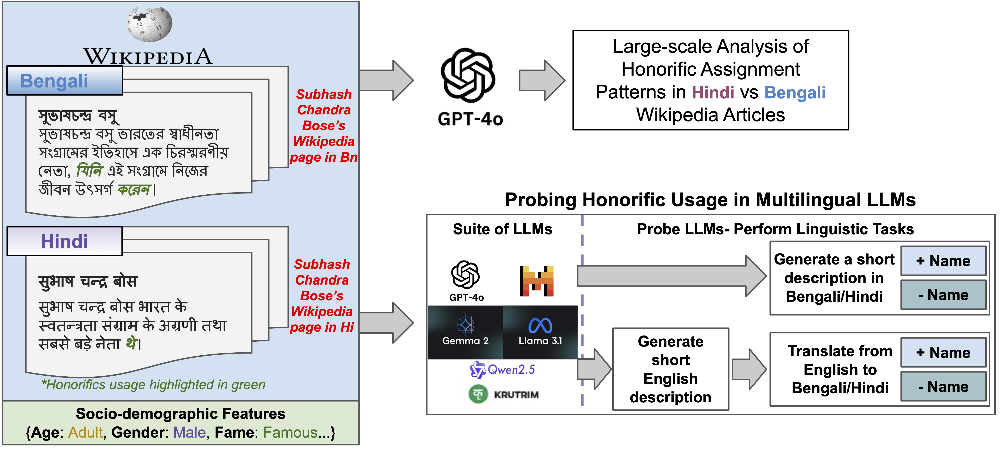

# A Comparative Study of Honorific Usages in Wikipedia and LLMs for Bengali and Hindi
<!--<p align="center"> <a href="" target="_blank">Sourabrata Mukherjee</a>, <a href="" target="_blank">Atharva Mehta</a>, <a href="" target="_blank">Sougata Saha</a>,  <a href="" target="_blank">Akhil Arora</a>, <a href="" target="_blank">Monojit Choudhury</a></p>
<p align="center" float="left">
  
  
</p>-->

[](https://www.apache.org/licenses/LICENSE-2.0)
[](https://creativecommons.org/licenses/by-nc/4.0/)

Honorifics are powerful linguistic tools that encode social hierarchies and cultural norms<sup>[1]</sup>. While English relies on titles (e.g., Mr., Sir) without grammaticalized honorifics, many South Asian languages, including Hindi and Bengali, require speakers to explicitly mark formality in pronouns<sup>[2]</sup>. 

For example, a simple sentence like *"She is a doctor"* in Hindi must commit to either an **<span style="color:green">honorific</span>** (*"**<span style="color:green">ve</span>** chikitsak <span style="color:green">hain</span>"*) or **<span style="color:orange">non-honorific</span>** (*"**<span style="color:orange">vaha</span>** chikitsak <span style="color:orange">hai</span>"*) construction. Such choices in Hindi and Bengali are not optional but essential, signaling respect, age, status, and familiarity.

## Illustration of the complete work pipeline

We conduct a large-scale analysis of 10,000 Wikipedia articles each in Hindi (HI) and Bengali (BN), sampled across seven socio-demographic dimensions, to examine patterns of honorific usage. The analysis employs GPT-4o as the annotation tool, which exhibits strong performance as confirmed by human evaluations.

Moreover, as LLMs rely heavily on such online sources for training, it is unclear whether they accurately reflect the honorific usage patterns observed in Wikipedia, especially across diverse socio-demographic contexts. To investigate this, we evaluate six state-of-the-art LLMs (*GPT-4o, Llama-3.1, Gemma, Mistral , Qwen-2.5, Krutrim-2*) through controlled generation and translation tasks involving 1,000 culturally balanced entities, sampled using the same socio-demographic dimensions and formality settings.

A complete pipeline of our work is illustrated below,

<p align="center" float="left">
  
</p>


## Key Contributions

i. **A first-of-its-kind large-scale empirical study** of honorific usage across 10,000 Hindi (HI) and Bengali (BN) Wikipedia articles, analyzing cross-lingual differences across seven diverse socio-demographic dimensions (including gender, age group, fame, and cultural origin).

ii. **A framework for evaluating honorific behavior in multilingual LLMs**, using generation and translation tasks to measure their usage patterns across similar socio-demographic features and formality settings as Wikipedia.

iii. **The public release of a dataset** comprising 20,000 annotated Wikipedia articles and LLM outputs for 1,000 entities.

### More details coming soon ...

## Citation
Please cite us if you use our data or models.
```bibtex
    Will update the information soon ...
```

### References

[1] Asif Agha. 1998. Stereotypes and registers of honorific language. Language in society, 27(2):151–193.

[2] Johannes Helmbrecht. 2013. Politeness distinctions in pronouns (v2020.4). In Matthew S. Dryer and Martin Haspelmath, editors, The World Atlas of Language Structures Online. Zenodo.
